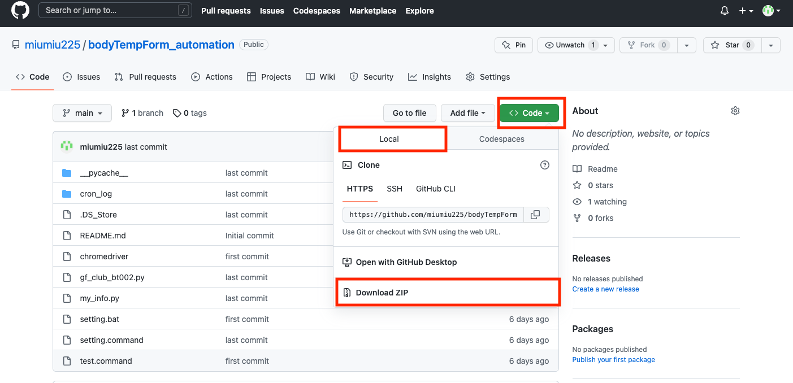
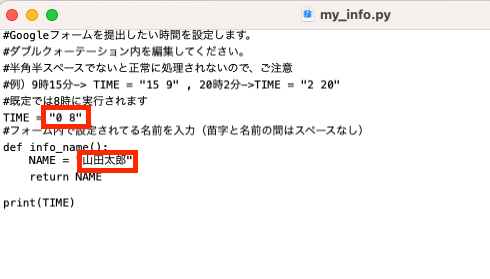
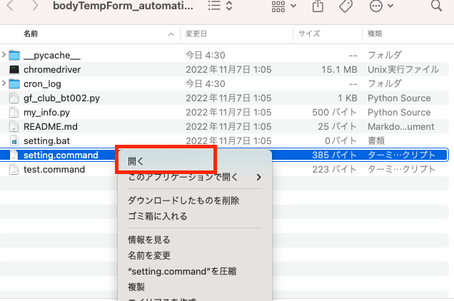
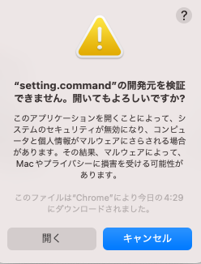
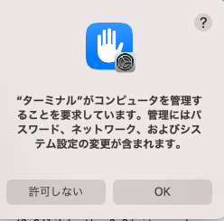

# bodyTempForm_automation

## 0. はじめに
毎日の体温入力を自動で行うプログラム（今の所macのみ）を作りました。

最初に以下の「使い方」に従い、パソコンの設定を行うと定時にランダムな体温を入力し、提出します。

なるべく簡単に使えるようにしたので、是非使ってみてください。

希望があればwindows版も作りますので、ご連絡いただければと思います。

## 1. 使い方
### 1.1 python のダウンロード
python3の環境がないと今回のプログラムが動かないので、

[このサイト](https://prog-8.com/docs/python-env)を参考にpythonをダウンロードしてください。

既にpythonがダウンロードされている場合、次の手順から進めてください。

### 1.2 プログラムをダウンロード・実行
本ページ右上の「Code」から「local」を選択し、本プログラムのzipフォルダを

好きな場所に保存してください。

zipフォルダを展開し、ダウンロードしたフォルダを開いてください。

フォルダ内に「my_info.py」というファイルがあるので、これを開きます

このような画面になったら赤枠内の箇所（時間、名前）を変更し、保存します。

保存できたら、次は、「setting.command」を「右クリック」から「開く」を押します。

このようにポップアップが出てきますが「開く」を選択します。

するとプログラムをPC内に設定しはじめます。

実行中に以下のメッセージが表示されますが、「OK」を押します

これで全ての設定が完了しました。

指定した時間に自動でGoogleフォームを埋めて回答を送信します。パソコンが開いてない、電源が付いてないと実行されませんので、ご注意ください。

毎日の実行結果は、「cron_log」フォルダないの日付ファイルから確認できます。

ファイル内に「done」と表示があれば、できてます。errorがあれば問題があるので、手動で送信してください。
